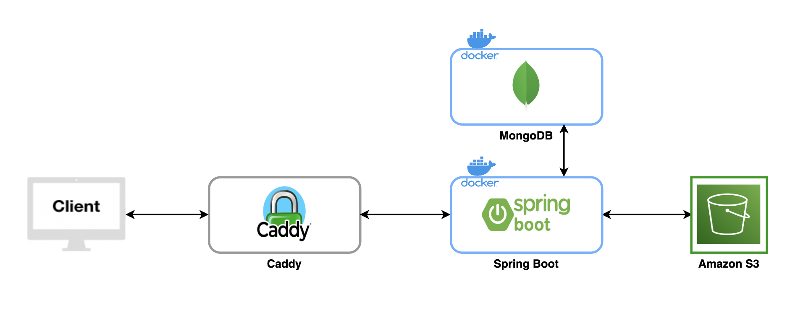
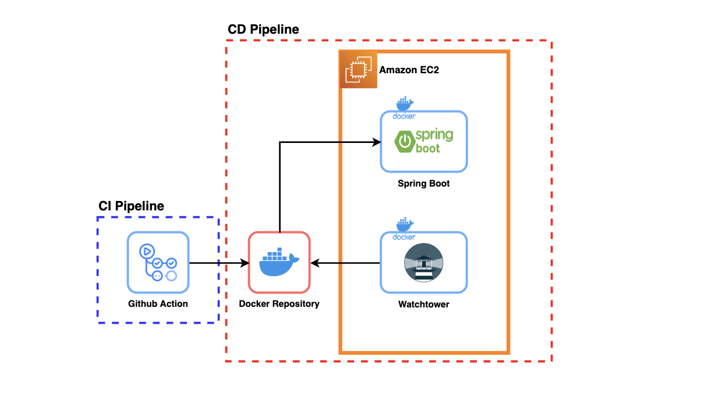

# Gabojait (가보자잇)

### 가보자it으로 사이드 프로젝트를 함께할 팀원을 찾다.

App Store:

Play Store:

---

## Database 
### [Database 문서](doc/database.md)

---

## [API Documentation](https://gabojait-dev.nogamsung.com/swagger-ui/index.html)
#### [API 문서 관련 설명](doc/api_document_explanation.md)

---

## Architecture

---

## CI/CD Pipeline

---

## Rule
- [Commit Convention](https://doublesprogramming.tistory.com/256)
- [Semantic Versioning](https://semver.org/lang/ko/)

---

## Repository Link
- [React Native](https://github.com/gabojait/gabojait-react-native)
