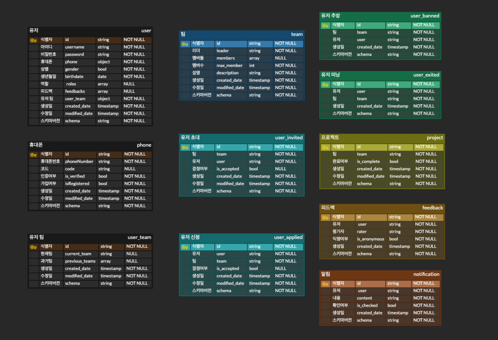

# Gabojait

    
    
    

**Gabojait(가보자it)은 개발자, 디자이너 등의 여러 유형의 직군의 사람들이 같이 사이드 프로젝트를 할 수 있는 팀원들을 찾을 수 있게 도움을 주는 플랫폼 서비스입니다.**

## Database Diagram

## API Document

| 내용         | HTTP 메소드 | URI                      | 응답 데이터       |
|------------|----------|--------------------------|--------------|
| User 생성    | POST     | /user/                   | userId       |
| User 수정    | PATCH    | /user/{userId}           | userId       |
| User 탈퇴    | DELETE   | /user/{userId}           |              |
| User 전체 조회 | GET      | /user/                   | List<User>   |
| User 단건 조회 | GET      | /user/{userId}           | User         |
| Team 생성    | POST     | /team/{userId}           | teamId       |
| Team 멤버 추가 | PATCH    | /team/{teamId}/{userId}  | teamId       |
| Team 멤버 제거 | PATCH    | /teams/{teamId}/{userId} | teamId       |
| Team 제거    | DELETE   | /team/{teamId}           |              |
| Team 전체 조회 | GET      | /team                    | List<Team>   |
| Team 단건 조회 | GET      | /team/{teamId}           | Team         |
| Review 생성  | POST     | /review/{userId}/        | reviewId     |
| Review 조회  | GET      | /user/{userId}/review/   | List<Review> |

- 응답 방법
  - HTTP 응답 코드
  - 데이터
  - 메시지

### [Swagger] coming soon