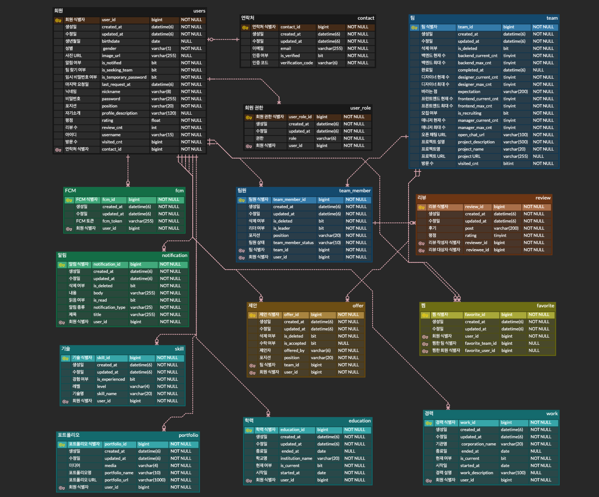

# 가보자IT

### 가보자IT으로 사이드 프로젝트를 함께할 팀원을 찾다.

App Store:

Play Store:

---

## Link
- ### [API Status Page](https://uptime-kuma.nogamsung.com/status/gabojait)
- ### [Test API Swagger](https://gabojait-dev.nogamsung.com/api/v1/docs/swagger-ui/index.html)
- ### [Load Test Result](docs/LoadTestResult.md)
- ### [Client Repository](https://github.com/gabojait/gabojait-react-native)

---

## Database 

---

## Architecture

---

## CI/CD Pipeline

---

## Monitor
- ### [Uptime Kuma](https://uptime-kuma.nogamsung.com/status/gabojait)
- ### Sentry

--

## Rule
- ### [Commit Convention](https://doublesprogramming.tistory.com/256)
- ### [Semantic Versioning](https://semver.org/lang/ko/)
