# 부하 테스트 결과

## 환경 🖥️

### 웹 서버 & 웹 애플리케이션 서버
- 1 vCPU
- 1 GiB Memory + 1 GiB Virtual Memory
- 30 GiB Storage

### 데이터베이스 서버
- 2 vCPU
- 1 GiB Memory
- 20 GiB Storage

## 목차 📋
1. [회원](#user)
2. [프로필](#profile)
3. [팀](#team)
4. [찜](#favorite)
5. [제안](#offer)
6. [리뷰](#review)
7. [개발](#develop)

---

## 1️⃣ 회원
### 본인 조회
#### vUser 99
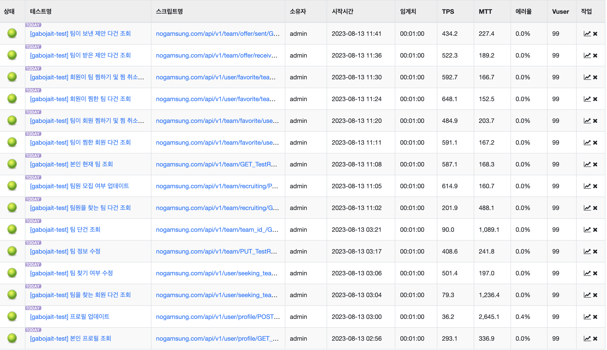

#### vUser 296
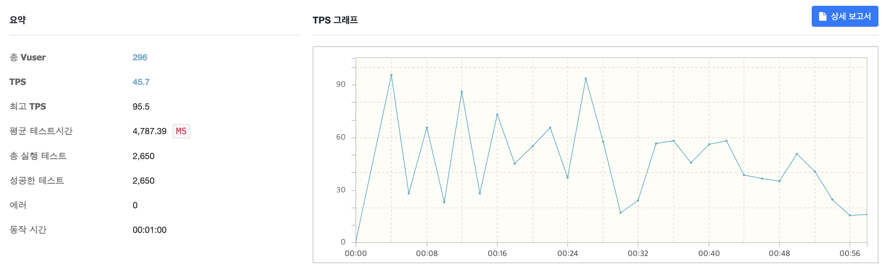

#### vUser 500
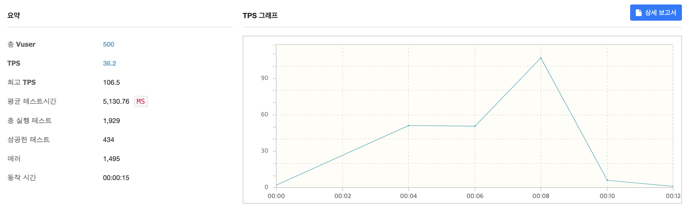

### 로그인
#### vUser 99

#### vUser 296

#### vUser 500

### 로그아웃
#### vUser 99

#### vUser 296

#### vUser 500

### 닉네임 중복여부 확인
#### vUser 99

#### vUser 296

#### vUser 500

### 알림 업데이트
#### vUser 99

#### vUser 296

#### vUser 500
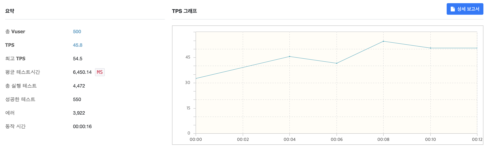

### 비밀번호 업데이트
#### vUser 99
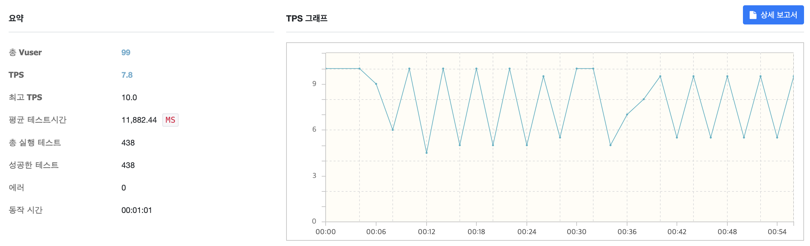

#### vUser 296
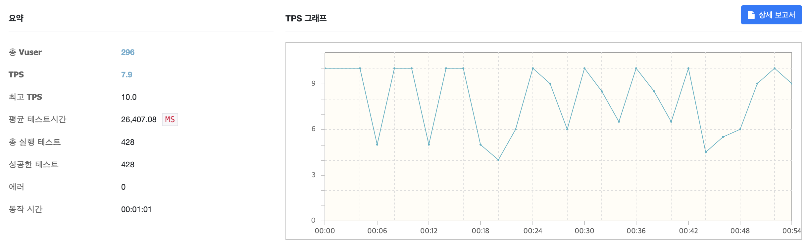

#### vUser 500

### 비밀번호 검증
#### vUser 99
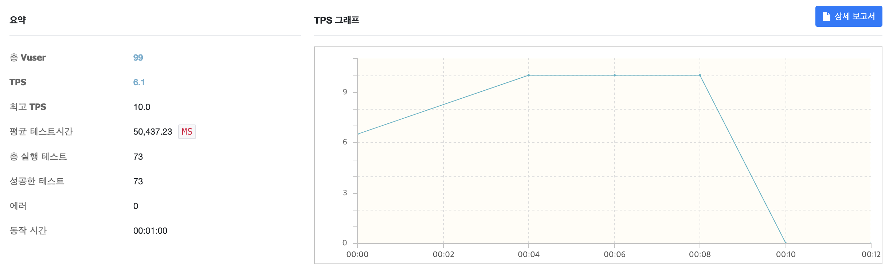

#### vUser 296

#### vUser 500

### 토큰 재발급
#### vUser 99

#### vUser 296

#### vUser 500

### 아이디 중복여부 확인
#### vUser 99

#### vUser 296

#### vUser 500

---

## 2️⃣ 프로필 
### 프로필 단건 조회
#### vUser 99

#### vUser 296

#### vUser 500

### 자기소개 업데이트
#### vUser 99

#### vUser 296

#### vUser 500

### 프로필 사진 삭제
#### vUser 99

#### vUser 296

#### vUser 500
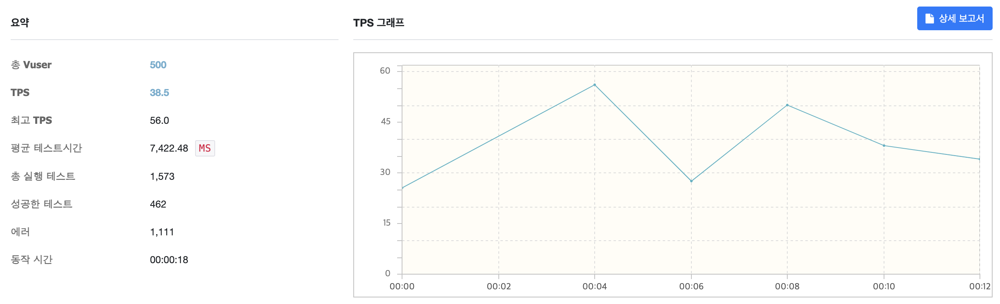

### 본인 프로필 조회
#### vUser 99

#### vUser 296

#### vUser 500

### 프로필 업데이트
#### vUser 99

#### vUser 296

#### vUser 500

### 팀을 찾는 회원 다건 조회
#### vUser 99

#### vUser 296
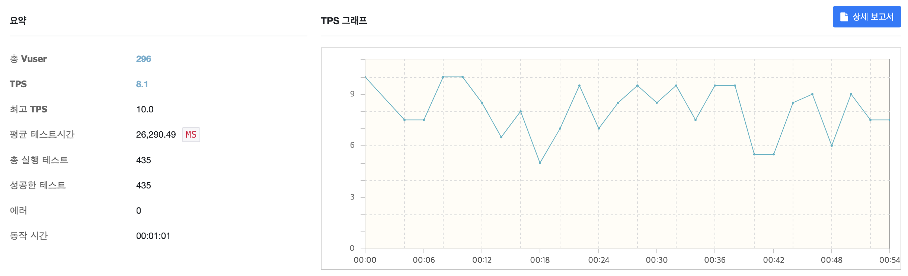

#### vUser 500

### 팀 찾기 여부 수정
#### vUser 99

#### vUser 296

#### vUser 500
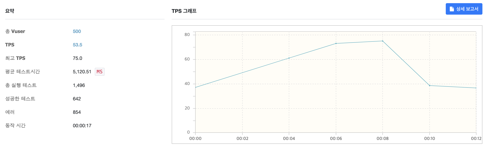

---

## 3️⃣ 팀
### 팀 정보 수정
#### vUser 99
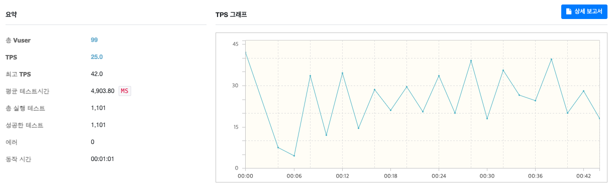

#### vUser 296

#### vUser 500

### 팀 단건 조회
#### vUser 99

#### vUser 296

#### vUser 500

### 팀원 찾는 팀 다건 조회
#### vUser 99
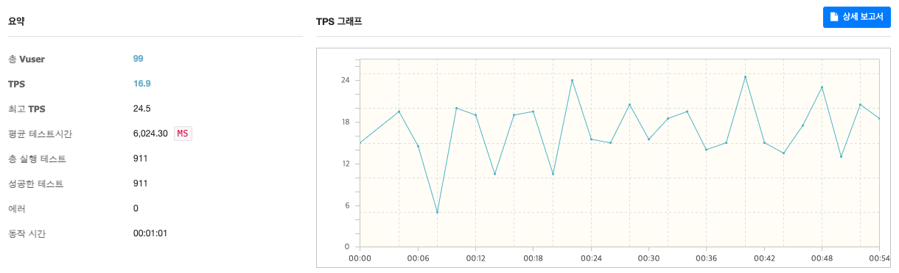

#### vUser 296

#### vUser 500

### 팀원 모집 여부 업데이트
#### vUser 99

#### vUser 296

#### vUser 500

### 본인 현재 팀 조회
#### vUser 99

#### vUser 296

#### vUser 500

---

## 4️⃣ 찜
### 팀이 찜한 회원 다건 조회
#### vUser 99
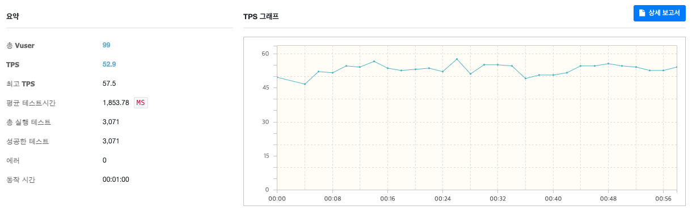

#### vUser 296
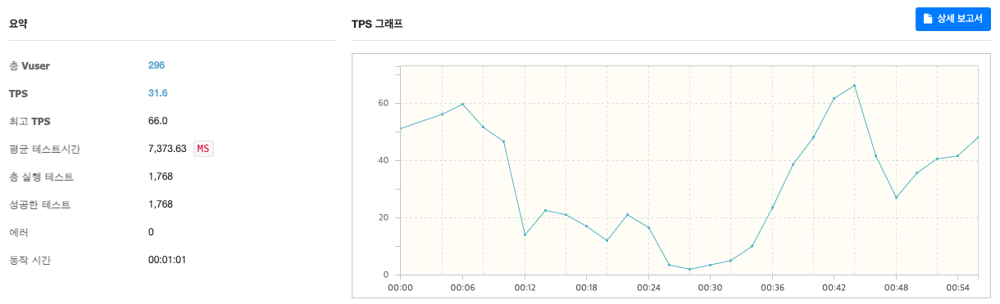

#### vUser 500

### 팀이 회원 찜하기 및 찜 취소하기
#### vUser 99

#### vUser 296

#### vUser 500

### 회원이 찜한 팀 다건 조회
#### vUser 99

#### vUser 296

#### vUser 500

### 회원이 팀 찜하기 및 찜 취소하기
#### vUser 99

#### vUser 296

#### vUser 500

---

## 5️⃣ 제안
### 팀이 받은 제안 다건 조회
#### vUser 99

#### vUser 296

#### vUser 500

### 팀이 보낸 제안 다건 조회
#### vUser 99

#### vUser 296

#### vUser 500
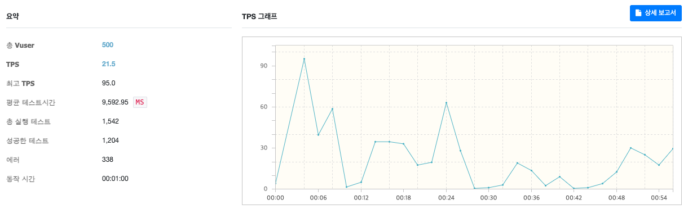

### 팀이 회원에게 스카웃
#### vUser 99

#### vUser 296

#### vUser 500

### 회원이 받은 제안 다건 조회
#### vUser 99

#### vUser 296
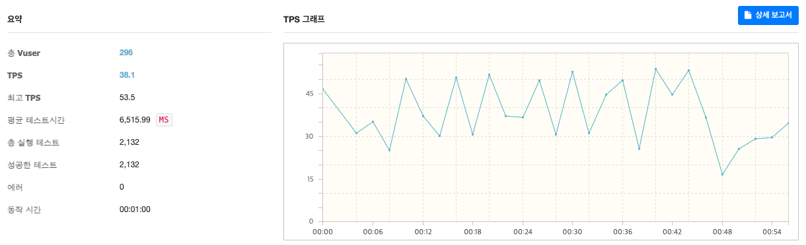

#### vUser 500

### 회원이 보낸 제안 다건 조회
#### vUser 99
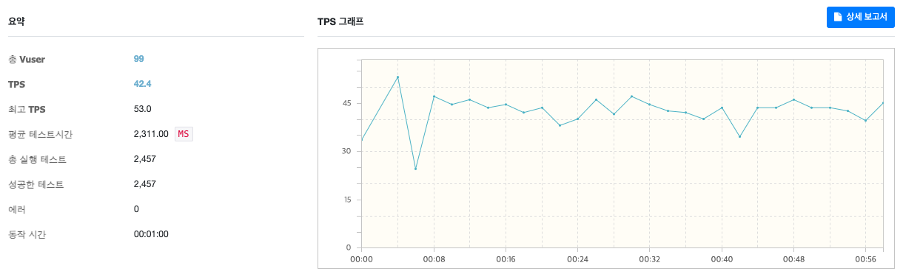

#### vUser 296
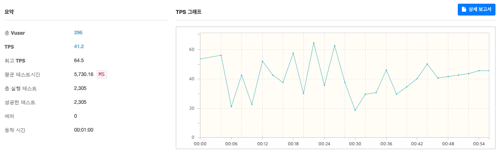

#### vUser 500

### 회원이 팀에 지원
#### vUser 99

#### vUser 296

#### vUser 500

---

## 6️⃣ 리뷰
### 회원 리뷰 다건 조회
#### vUser 99

#### vUser 296

#### vUser 500

### 본인 리뷰 작성 가능한 팀 전체 조회
#### vUser 99

#### vUser 296

#### vUser 500

---

## 7️⃣ 개발
### 헬스 체크
#### vUser 99

#### vUser 296
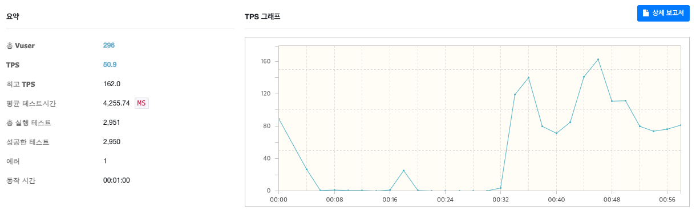

#### vUser 500

